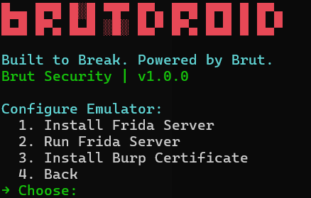

<h1 align="center">
  🧨 BrutDroid - Android Studio Pentest Automator
</h1>

```bash
    ____             __  ____             _     __
   / __ )_______  __/ /_/ __ \_________  (_)___/ /
  / __  / ___/ / / / __/ / / / ___/ __ \/ / __  /
 / /_/ / /  / /_/ / /_/ /_/ / /  / /_/ / / /_/ /
/_____/_/   \__,_/\__/_____/_/   \____/_/\__,_/

          Made with ❤️ by Brut Security
```

<p align="center">
  <a href="https://github.com/Brut-Security/BrutDroid/stargazers"></a>
  <a href="https://github.com/Brut-Security/BrutDroid/issues"></a>
  <a href="https://t.me/BrutSecurity"></a>
</p>

---

## 🚀 Overview

**BrutDroid 2.0** is a powerful, Windows-optimized toolkit designed specifically for **Android Studio**, streamlining the setup of a mobile penetration testing lab. Built to make Android pentesting effortless, it automates **emulator creation, rooting, Frida server setup, and Burp Suite certificate installation**. With a vibrant new UI and support for custom Frida scripts, BrutDroid empowers security researchers to focus on testing, not setup. **Linux support is coming soon!**


## ✨ Key Features

- **Windows & Android Studio Optimized**: Seamlessly integrates with Windows Terminal and Android Studio for a smooth pentesting experience.[](https://github.com/Brut-Security/BrutDroid)
- **One-Click Rooting**: Automatically roots emulators (API 31, x86_64/arm64) using Magisk and rootAVD, eliminating manual setup.[](https://github.com/Brut-Security/BrutDroid)
- **Burp Suite Integration**: Simplifies HTTPS traffic interception by installing system-trusted Burp CA certificates via Magisk modules.[](https://github.com/Brut-Security/BrutDroid)
- **Custom Frida Scripts**: Add and run your own Frida scripts alongside built-in SSL pinning and root detection bypasses.[](https://github.com/Brut-Security/BrutDroid)
- **Vibrant New UI**: Bold colors, ASCII art animations, and an intuitive CLI make pentesting engaging and efficient.[](https://github.com/Brut-Security/BrutDroid)
- **Frida Powerhouse**: Easily run Frida server, list apps, and execute scripts for dynamic instrumentation.[](https://github.com/Brut-Security/BrutDroid)
- **Tool Installation**: One-click deployment of `frida-tools`, `objection`, `reflutter`, and more.[](https://github.com/Brut-Security/BrutDroid)
- **Upcoming Linux Support**: Expanding compatibility for Linux users in the next update.

---

## 🚀 Getting Started

### Prerequisites
- **Operating System**: Windows (Linux support coming soon)
- **Software**:
  - Python 3.9+ (not Microsoft Store version)
  - Android Studio with Android SDK Platform-Tools
  - `frida-tools` (install via `pip install frida-tools`)
  - `curl` (included in Git Bash or install from https://curl.se/windows/)
- **Hardware**: Virtualization enabled (VT-x/AMD-V) for emulators
- **Internet**: Required for downloading Magisk, rootAVD, and Frida server

---

## ⚡ Installation

### 1. Clone the Repository:
   ```bash
   git clone https://github.com/Brut-Security/BrutDroid.git
   cd BrutDroid
   ```

### 2. Install Dependencies:
```bash
pip install -r requirements.txt
```

### 3. Run BrutDroid:
```bash
python BrutDroid.py
```

---

## 🛠️ Usage

### Automating Rooting
- Select Root Emulator to download and install Magisk, patch the system image with rootAVD, and finalize root setup.
- Follow prompts to cold boot the emulator and complete Magisk configuration.

### Installing Burp Certificate
- Select Configure Emulator → Install Burp Suite Certificate.
- Ensure Burp Suite is running on 127.0.0.1:8080 and the emulator proxy is set.
- BrutDroid automates certificate download, conversion, and installation as a system-trusted CA using the AlwaysTrustUserCerts Magisk module.

### Adding Custom Frida Scripts
- Navigate to Frida Tools → Add Custom Script.
- Paste your Frida script code, name it (e.g., MyScript.js), and save it to the Fripts directory.
- Custom scripts appear in the Frida Tools menu (options 6+) and persist across sessions. Default scripts (SSL-BYE.js, ROOTER.js, PintooR.js) are reserved for predefined options.

### Running Frida Server
- Select Run Frida Server to start the Frida server in the background on the emulator.
- Requires a rooted emulator with Frida server installed (via Configure Emulator → Install Frida Server).

---


## 📸 Screenshots

<p align="center">
  
  <br>
  <u><em>Main Menu | Vibrant new UI with clear menu options
  </em></u>
</p>

<p align="center">
  
  <br>
  <u><em>Frida Tools | Frida Tools menu with custom script support
  </em></u>
</p>

---

## 🔐 Pentesting Made Easy - Full Walkthrough

BrutDroid 2.0 is tailored for mobile pentesters, automating the tedious setup of a rooted Android emulator and Burp Suite integration. Whether bypassing SSL pinning, defeating root detection, or injecting custom Frida scripts, BrutDroid simplifies the process so you can focus on finding vulnerabilities. The new UI adds a hacker vibe with colorful ASCII art, while Windows and Android Studio optimization ensures a seamless experience.


[](https://youtu.be/8iYf5lJOmXo)

---

## 🛡️ Troubleshooting

- **Emulator Not Detected:** Run `adb devices` to verify connection. Ensure Android Studio emulator is running (API 31, x86_64/arm64).
- **Rooting Fails:** Verify `ANDROID_HOME` is set and system image path is correct. Check `rootAVD_list.txt` for details.
- **Certificate Issues:** Ensure Burp Suite is on `127.0.0.1:8080` and emulator proxy is set. Reboot after installing `AlwaysTrustUserCerts`.
- **Frida Script Errors:** Confirm scripts are in `Fripts` and Frida server is running. Use `frida-ps -U` to verify.
- **Need Help? Join our Telegram:** [`@BrutSecurity`](https://t.me/BrutSecurity) or visit the Frida documentation.

---

## 🙏 Credits

BrutDroid stands on the shoulders of giants:

- Inspiration: [Noxer by AggressiveUser](https://github.com/AggressiveUser/noxer/)  
- Core Tools:  
  - [Frida (for dynamic instrumentation)](https://github.com/frida/frida)  
  - [Magisk by topjohnwu (for rooting)](https://github.com/topjohnwu/Magisk)  
  - [rootAVD by NewBit (for emulator patching)](https://gitlab.com/newbit/rootAVD)  
  - [AlwaysTrustUserCerts by NVISOsecurity (for certificate trust)](https://github.com/NVISOsecurity/AlwaysTrustUserCerts)

---

## 💌 Contact
- [Brut Security:](https://t.me/BrutSecurity)
- [GitHub Issues:](https://github.com/Brut-Security/BrutDroid/issues)
- [Brut Security](https://brutsec.com)

---

## 📜 License

🔐 **BrutDroid is licensed under the MIT License (LICENSE).**  

---

<p align="center">
  <em>Hack smart. Break hard. Stay Brut.</em>
</p>
