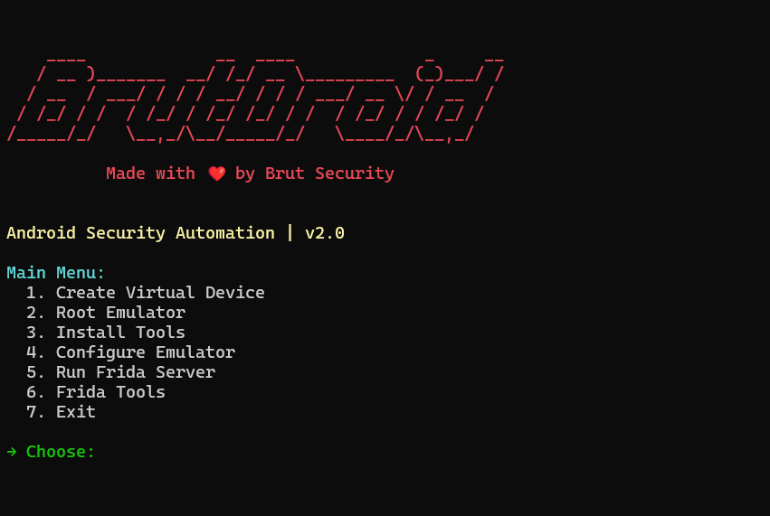

<h1 align="center">
  🧨 BrutDroid — Android Security Toolkit
</h1>


<p align="center">
  <a href="https://github.com/Brut-Security/BrutDroid/stargazers"></a>
  <a href="https://github.com/Brut-Security/BrutDroid/issues"></a>
  <a href="https://t.me/BrutSecurity"></a>
  
</p>

---

## 🚀 Overview

**BrutDroid** is the ultimate automation toolkit for Android emulator testing, crafted for red teamers, pentesters, and app security enthusiasts. With a sleek, colorful CLI, it streamlines complex tasks like rooting emulators, setting up Frida for bypasses, installing Burp certificates, and more—saving you hours of manual setup. Whether you’re breaking apps or testing defenses, BrutDroid is your go-to weapon.

🔥 **Why BrutDroid?**  
- Automates tedious emulator setup with one command.  
- Integrates powerful tools like Frida, Magisk, and rootAVD.  
- Designed for Windows with Android Studio emulators.  
- Eye-catching UI that makes pentesting fun.

---

## ✨ Key Features

- 🛡️ **Environment Validation**: Ensures Python, ADB, and system readiness.  
- 🌱 **One-Click Rooting**: Auto-patches emulators with Magisk and rootAVD.  
- ⚡ **Frida Powerhouse**: Run SSL pinning and root detection bypasses with ease.  
- 🔒 **Burp Integration**: Installs system-trusted certificates via Magisk modules.  
- 🎨 **Vibrant CLI**: Bold colors and ASCII art for a hacker vibe.  
- 🪟 **Windows-Optimized**: Seamless experience with Windows Terminal.  

---

## 🛠️ Requirements

Before diving in, ensure you have:

- 🐍 **Python 3.9+** (added to system PATH)  
- 📱 **ADB** (Android SDK platform-tools, added to PATH)  
- 🖥️ **Android Studio** (for emulator management)  
- 🌐 **Burp Suite** (for certificate setup)  
- 🌍 **Internet Connection** (for downloading Magisk, Frida, etc.)  

---

## ⚡ Installation

Get BrutDroid up and running in minutes:

### 1. Clone the Repository:
```bash
git clone https://github.com/yourusername/BrutDroid.git
cd BrutDroid
```

### 2. Install Dependencies:
```bash
pip install -r requirements.txt
```

### 3. Run BrutDroid:
```bash
python BrutDroid.py
```

---

## 🧭 Usage

Launch BrutDroid and navigate the intuitive menu:
```bash
python BrutDroid.py
```

### Main Menu Options
- **Create Virtual Device**: Set up an emulator (API 31, x86_64/arm64).  
- **Root Emulator**: Auto-root with Magisk and rootAVD.  
- **Install Tools**: Deploy `frida-tools`, `objection`, `reflutter`, etc.  
- **Configure Emulator**: Install Frida server, Burp certs, and more.  
- **Frida Tools**: Run SSL/root bypasses or start Frida server.  
- **Exit**: Close BrutDroid.

---

### Example: Rooting an Emulator
```
→ Main Menu
  2. Root Emulator
→ Fetching latest Magisk version...
→ Downloading Magisk v30.0...
→ Installing Magisk...
→ Enter the system image path (e.g., system-images\android-31\google_apis\x86_64\ramdisk.img)
```

---

### Example: Running a Frida Bypass
```
→ Frida Tools
  2. Bypass SSL Pinning
→ Enter package name: com.example.app
→ Executing bypass...
✔ Bypass executed.
```

---

## 📸 Screenshots

<p align="center">
  
  <br>
  <u><em>BrutDroid’s vibrant CLI in action.</em></u>
</p>


---

## 🙏 Credits

BrutDroid stands on the shoulders of giants:

- Inspiration: [Noxer by AggressiveUser](https://github.com/AggressiveUser/noxer/)  
- Core Tools:  
  - [Frida (for dynamic instrumentation)](https://github.com/frida/frida)  
  - [Magisk by topjohnwu (for rooting)](https://github.com/topjohnwu/Magisk)  
  - [rootAVD by NewBit (for emulator patching)](https://gitlab.com/newbit/rootAVD)  
  - [AlwaysTrustUserCerts by NVISOsecurity (for certificate trust)](https://github.com/NVISOsecurity/AlwaysTrustUserCerts)

---

## 👨‍💻 Developed by: [Brut Security](https://t.me/BrutSecurity)

---

## 📜 License

🔐 **For Educational Use Only**  
BrutDroid is licensed for academic and research purposes. You are responsible for its use. See LICENSE for details.

---

<p align="center">
  <em>Hack smart. Break hard. Stay Brut.</em>
</p>
